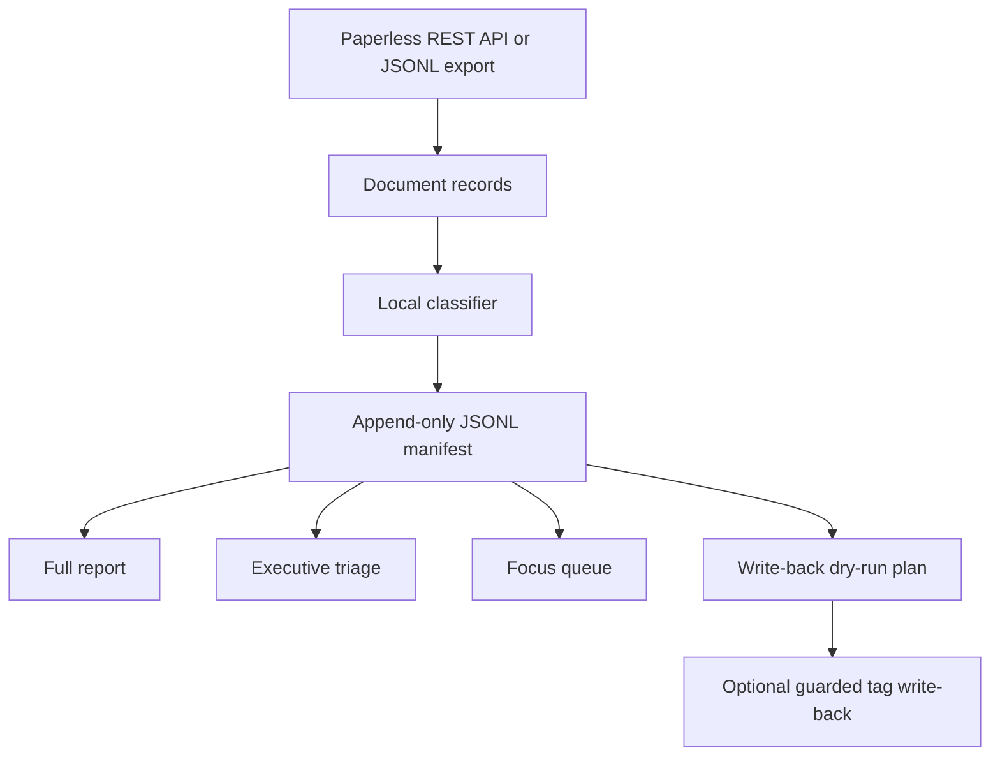

# Architecture

Paperless Review Companion is intentionally small:

## Components

- `client.py`: Paperless REST API client using only the Python standard library.
- `review.py`: prompt construction, Ollama calls, rules-only fallback, and result
  normalization.
- `manifest.py`: JSONL loading, writing, and latest-row selection.
- `renderers.py`: Markdown report generation.
- `writeback.py`: dry-run planning and guarded tag application.
- `cli.py`: command-line interface.

## Manifest Shape

Each review row contains:

- `status`: `reviewed` or an error status
- `document`: metadata and optional OCR excerpt
- `review`: normalized model or rules-only classification

Rendering functions deduplicate by `document.id`, so resumed manifests can stay
append-only while reports show the latest row for each document.

## Why REST API Instead Of Docker Exec

The original prototype was built for one local machine and called a fixed Docker
container. The public version uses the Paperless REST API so it can work with
Docker, bare-metal, NAS, or remote self-hosted Paperless instances.

